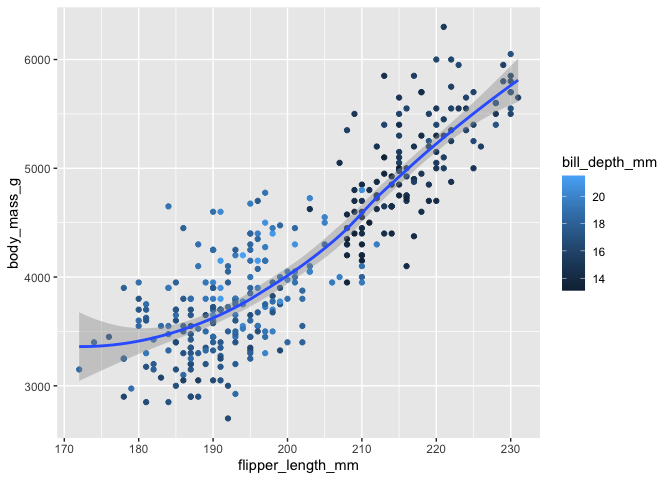

# Homework 03

# Base R and R Basics

HINT: Remember that you can get help on any function by typing
`?`(function name). For instance, `?rnorm` gives help on the `rnorm()`
function.

## Creating and naming variables

1.  Create a variable called `x` and use it to store the result of the
    calculation `(3*(4+2)`.

    ``` r
    x<- (3*(4+2))
    ```

2.  Calculate the product of `x` (from the above question) times π.

``` r
result <- 18*pi
```

3.  Use the `getwd()` function to show your current working directory.
    Is that a good working directory, and what program do you think set
    it that way?

- I think this is a good working directory because it clearly shows
  where my directory is stored and shows the exact location/folders. The
  program I used to set this up was ‘setwd()’.

``` r
getwd()
```

    [1] "/Users/jemmamcleish/Library/CloudStorage/OneDrive-UniversityofTennessee/University of Tennessee/UTK Year 4/Fall 2023/MICR575 Reproducible data"

## Vectors

1.  Use the `c()` function to create a vector of numbers.

``` r
vector_of_numbers <- c(1,2,3,4,5,6,7)
```

2.  Use the `c()` function to create a vector of characters.

``` r
vector_of_characters <- c("zumba","yoga", "barbell", "spin")
```

3.  Use the `:` implicit function to create a vector of integers from 1
    to 10.

``` r
vector_of_integers <- c(1:10)
```

4.  Explain *why* the following code returns what it does. Also address
    whether you think this was a good decision on the part of the
    designers of R?
    - The following code shows the following messag:

      **Warning message: In v1 + v2 : longer object length is not a
      multiple of shorter object length \>**

    - this message is shown because the length of v1 is shorter than v2
      and the program will not automatically recycle the first vector in
      v1 to compensate for the length issue.

    - In my opinion, it is a good idea on the part of the designers of R
      to give this warning message so that the user can easily spot
      issues in their analyses.

``` r
v1 <- 1:3
v2 <- c(1:4)
v1 + v2
```

    [1] 2 4 6 5

5.  Explain what the following code does. It may be helpful to reference
    the answer to the previous question:
    - The code is adding “3” to each vector and will produce the result:

      \[1\] 4 8 12

``` r
c(1, 5, 9) + 3
```

    [1]  4  8 12

6.  Remove (delete) every variable in your workspace.

``` r
rm(list=ls())
```

## Graphics

1.  Load the tidyverse package. **NOTE:** Be sure to use the chunk
    option `message=FALSE` to suppress the messages that tidyverse
    prints when loaded. These messages are useful in the

``` r
library(tidyverse)
```

    ── Attaching core tidyverse packages ──────────────────────── tidyverse 2.0.0 ──
    ✔ dplyr     1.1.3     ✔ readr     2.1.4
    ✔ forcats   1.0.0     ✔ stringr   1.5.0
    ✔ ggplot2   3.4.3     ✔ tibble    3.2.1
    ✔ lubridate 1.9.2     ✔ tidyr     1.3.0
    ✔ purrr     1.0.2     
    ── Conflicts ────────────────────────────────────────── tidyverse_conflicts() ──
    ✖ dplyr::filter() masks stats::filter()
    ✖ dplyr::lag()    masks stats::lag()
    ℹ Use the conflicted package (<http://conflicted.r-lib.org/>) to force all conflicts to become errors

2.  Recreate the visualization of `body_mass_g` to `flipper_length_mm`,
    from the penguins data set, that is shown in question 8 of section
    2.2.5 of [R4DS](https://r4ds.hadley.nz/data-visualize).

``` r
library(palmerpenguins)
ggplot(
  data = penguins,
  mapping = aes(x = flipper_length_mm, y = body_mass_g)
) +
  geom_point(mapping = aes(color = bill_depth_mm)) +
  geom_smooth()
```

    `geom_smooth()` using method = 'loess' and formula = 'y ~ x'

    Warning: Removed 2 rows containing non-finite values (`stat_smooth()`).

    Warning: Removed 2 rows containing missing values (`geom_point()`).



3.  Explain why each aesthetic is mapped at the level that it is (i.e.,
    at the global level, in the `ggplot()` function call, or at the geom
    level, in the `geom_XXX()` function call). Note: A lot of different
    options will work, but some options are clearly better than others.

    - In the plot, flipper length (mm) and body mass (g) are mapped to
      the global level because they are the criteria used to make the x
      and y axes of the plot. The color aesthetic used for the bill
      depth (mm) is mapped to the geom level because allows us to
      examine/visualize where on the plot body mass and flipper length
      may differ in individual penguins.
